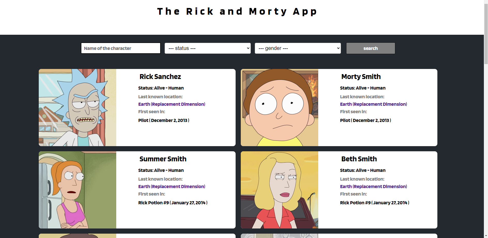

# Rick and Morty App

The rick and morty application was made with React and Typescript.

## How to run

Clone or fork this repository, go to your destination folder and run:

```
npm install
npm run start
```

The process will automaticaly open the game in a new browser tab.


## Images 




Juan Castro <juancruzcastro04@gmail.com>
